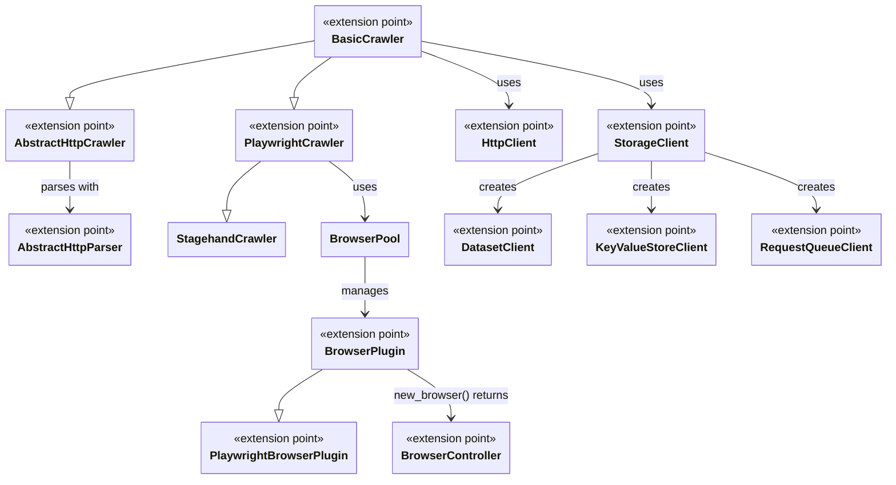

import ApiLink from '@site/src/components/ApiLink';

Crawlee covers the common cases out of the box, but sooner or later you'll hit something it doesn't do: a parser for a format no built-in crawler understands, an HTTP backend your company mandates, a database you want your data in, or a browser that isn't launched through the standard Playwright path. Rather than forking, you can plug your own implementation into the layer that differs and keep everything else.

This guide covers the extension points, the contract each one defines, and links to the guides that go deeper on each. If you maintain a third-party integration, you can build it against these contracts and host your own guide for it.

## Extension points

The four component families covered here contain the main extension points, and they're where most integrations plug in. They don't cover every extensible class in Crawlee. Other examples include <ApiLink to="class/RequestLoader">`RequestLoader`</ApiLink>, <ApiLink to="class/FingerprintGenerator">`FingerprintGenerator`</ApiLink>, and <ApiLink to="class/RenderingTypePredictor">`RenderingTypePredictor`</ApiLink>. In the diagram, the `extension point` marker means a class you can extend or implement.

### Crawlers

A crawler drives the whole run. It takes requests from the queue, fetches each one, builds the context object your handler receives, and manages retries, concurrency, sessions, and storage along the way. <ApiLink to="class/BasicCrawler">`BasicCrawler`</ApiLink> implements that orchestration and stays agnostic about how a page is fetched or parsed, which is what makes it the base every other crawler builds on. Extend it directly when a crawler has to fetch pages in a way neither the HTTP nor the browser layer covers.

For HTTP-based crawling, <ApiLink to="class/AbstractHttpCrawler">`AbstractHttpCrawler`</ApiLink> adds the fetch-and-parse layer. Its contract pairs a parser, a crawling context type, and a crawler class. The parser implements <ApiLink to="class/AbstractHttpParser">`AbstractHttpParser`</ApiLink>:

- `parse` turns an <ApiLink to="class/HttpResponse">`HttpResponse`</ApiLink> into your parsed type, and `parse_text` does the same for a string.
- `select` and `is_matching_selector` apply selectors.
- `find_links` extracts URLs for link enqueuing.

The context exposes the parsed data to handlers, and the crawler ties the parser and context together.

Browser crawlers use the same orchestration with a browser-backed context. Extend <ApiLink to="class/PlaywrightCrawler">`PlaywrightCrawler`</ApiLink> when an integration needs crawler-level browser behavior or a different handler context. <ApiLink to="class/StagehandCrawler">`StagehandCrawler`</ApiLink> is an example. It extends `PlaywrightCrawler` with a Stagehand-specific context and browser behavior. If only browser launch or lifecycle differs, a browser plugin is the narrower extension point.

See the [HTTP crawlers guide](../concepts/http-crawlers) for a worked example built on `selectolax`, and the [Stagehand crawler guide](./stagehand-crawler) for `StagehandCrawler` itself. The [Architecture overview](../concepts/architecture-overview) explains how HTTP and browser crawlers relate to the other components.

### HTTP clients

An HTTP client performs network calls for crawlers. Swapping it changes the transport, including the TLS stack, connection pooling, proxy handling, and browser impersonation. It doesn't change how pages are parsed or how the crawl is orchestrated.

The contract is <ApiLink to="class/HttpClient">`HttpClient`</ApiLink>:

- `crawl` performs a request inside the crawler's pipeline and returns the result the crawler consumes.
- `send_request` covers standalone calls made from a handler.
- `stream` yields a response you read incrementally.
- `cleanup` releases whatever the client holds open.

Crawlee ships <ApiLink to="class/ImpitHttpClient">`ImpitHttpClient`</ApiLink>, <ApiLink to="class/HttpxHttpClient">`HttpxHttpClient`</ApiLink>, and <ApiLink to="class/CurlImpersonateHttpClient">`CurlImpersonateHttpClient`</ApiLink>.

See the [HTTP clients guide](../concepts/http-clients) for the libraries these clients wrap and their installation requirements.

### Storage clients

A storage client is the backend behind Crawlee's three storages. <ApiLink to="class/Dataset">`Dataset`</ApiLink>, <ApiLink to="class/KeyValueStore">`KeyValueStore`</ApiLink>, and <ApiLink to="class/RequestQueue">`RequestQueue`</ApiLink> are the API you write against, and the storage client decides where that data actually lives. That separation is what lets you move a crawler from the local file system to a database or a cloud service without changing crawl code.

The <ApiLink to="class/StorageClient">`StorageClient`</ApiLink> contract defines three factory methods: `create_dataset_client`, `create_kvs_client`, and `create_rq_client`. The returned clients define the rest of the contract:

- <ApiLink to="class/DatasetClient">`DatasetClient`</ApiLink> handles appending and reading items.
- <ApiLink to="class/KeyValueStoreClient">`KeyValueStoreClient`</ApiLink> handles record access and iteration.
- <ApiLink to="class/RequestQueueClient">`RequestQueueClient`</ApiLink> handles adding, fetching, and marking requests as handled.

A custom backend implements all four classes.

See the [Storage clients guide](../concepts/storage-clients) for the built-in implementations and a custom client example.

### Browser plugins

A browser plugin launches browsers for <ApiLink to="class/PlaywrightCrawler">`PlaywrightCrawler`</ApiLink>. The crawler delegates that work to <ApiLink to="class/BrowserPool">`BrowserPool`</ApiLink>. The pool initializes its plugins, forwards browser context options when creating pages, and manages each browser's lifecycle.

The abstract contract is <ApiLink to="class/BrowserPlugin">`BrowserPlugin`</ApiLink>:

- `new_browser` launches a browser and returns a <ApiLink to="class/BrowserController">`BrowserController`</ApiLink>, which the pool uses to open pages and tear down the browser.
- `browser_launch_options` and `browser_new_context_options` hold the options the pool forwards.
- `browser_type` tells the pool what the plugin launches, and `max_open_pages_per_browser` is the per-browser page limit the plugin passes to the controllers it creates. The pool asks the controller for free capacity, not the plugin.
- `__aenter__` and `__aexit__` start and stop whatever the plugin holds open, and `active` reports whether the plugin is started.

Implement this base contract directly when the launch and lifecycle are too specific for Crawlee's Playwright integration. A plugin that launches something other than a standard Playwright browser also needs its own `BrowserController` implementation.

Most integrations should start with <ApiLink to="class/PlaywrightBrowserPlugin">`PlaywrightBrowserPlugin`</ApiLink>. Configure it when its launch and context options cover the required browser. Extend it when you need a custom Playwright-compatible launch path while preserving its standard lifecycle and context handling.

See the [Playwright crawler guide](../concepts/playwright-crawler) for the responsibilities a subclass has to preserve, and the [Camoufox example](./avoid-blocking#using-camoufox) for a complete integration.

## Choosing an extension point

Start with configuration before writing a subclass. You can parse a response with a third-party library inside an <ApiLink to="class/HttpCrawler">`HttpCrawler`</ApiLink> handler, pass an existing `http_client` to any crawler, or configure <ApiLink to="class/PlaywrightBrowserPlugin">`PlaywrightBrowserPlugin`</ApiLink>. Use an extension contract only when configuration doesn't cover the required behavior.

- If reusable HTTP parsing and the handler context both need to change, extend <ApiLink to="class/AbstractHttpCrawler">`AbstractHttpCrawler`</ApiLink> and implement <ApiLink to="class/AbstractHttpParser">`AbstractHttpParser`</ApiLink>.
- If browser-level orchestration or the handler context needs to change, extend <ApiLink to="class/PlaywrightCrawler">`PlaywrightCrawler`</ApiLink>.
- If the network transport needs to change while crawler behavior stays the same, implement <ApiLink to="class/HttpClient">`HttpClient`</ApiLink> and pass it to the crawler.
- If the storage backend needs to change while the storage API stays the same, implement <ApiLink to="class/StorageClient">`StorageClient`</ApiLink> and its three per-storage clients.
- If browser launch needs to change while the Playwright lifecycle stays the same, extend <ApiLink to="class/PlaywrightBrowserPlugin">`PlaywrightBrowserPlugin`</ApiLink>. Implement <ApiLink to="class/BrowserPlugin">`BrowserPlugin`</ApiLink> directly only when the Playwright plugin's launch and lifecycle contract needs a different implementation.

When more than one fits, pick the narrowest. A custom HTTP client works with every HTTP crawler, so it's easier to maintain than a crawler subclass that hard-codes the same transport.

## Conclusion

Each extension point has a documented class contract, and everything built on top of it keeps working once you implement that contract. Crawlee changes those contracts only in a major release, which makes them the stable surface for a third-party integration and its documentation.

If you have questions or need assistance, feel free to reach out on our [GitHub](https://github.com/apify/crawlee-python) or join our [Discord community](https://discord.com/invite/jyEM2PRvMU). Happy scraping!
