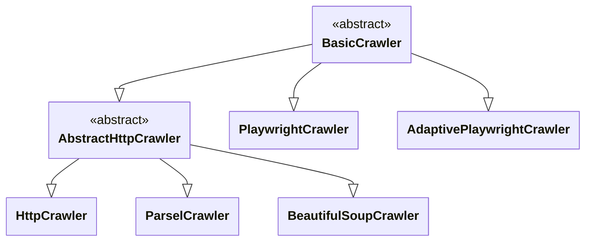
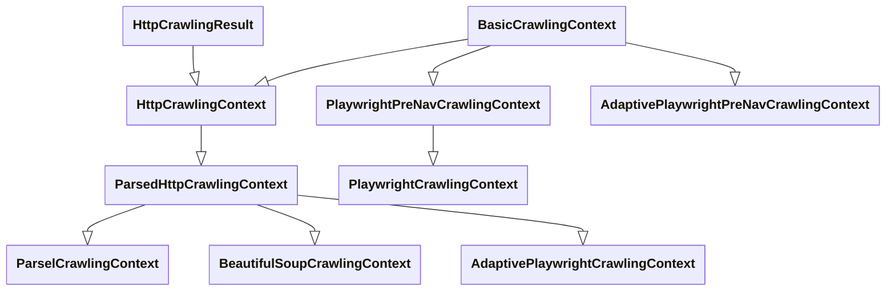
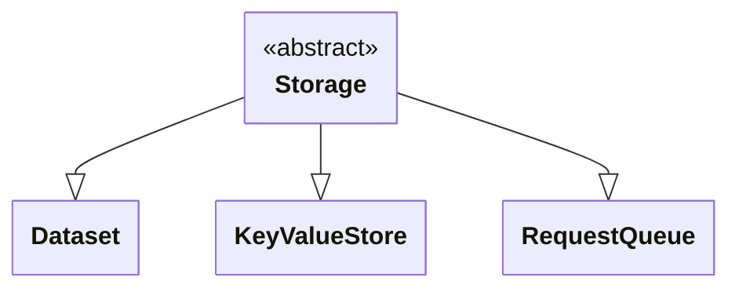
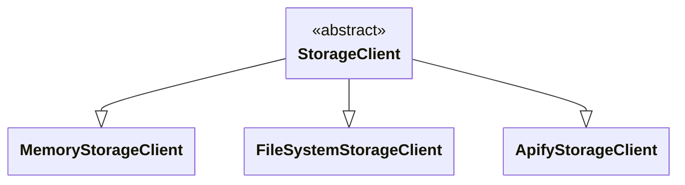
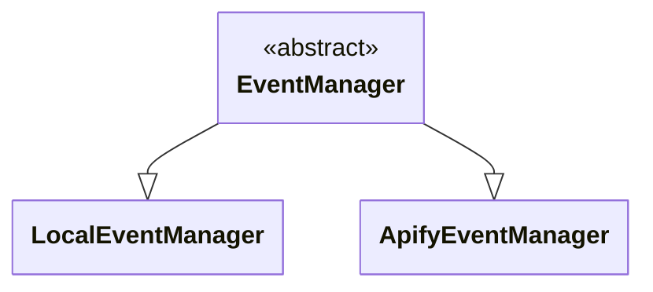

import ApiLink from '@site/src/components/ApiLink';

Crawlee is a modern and modular web scraping framework. It is designed for both HTTP-only and browser-based scraping. In this guide, we will provide a high-level overview of its architecture and the main components that make up the system.

## Crawler

The main user-facing component of Crawlee is the crawler, which orchestrates the crawling process and takes care of all other components. It manages storages, executes user-defined request handlers, handles retries, manages concurrency, and coordinates all other components. All crawlers inherit from the <ApiLink to="class/BasicCrawler">`BasicCrawler`</ApiLink> class, which provides the basic functionality. There are two main groups of specialized crawlers: HTTP crawlers and browser crawlers.

:::info

You will learn more about the request handlers in the request router section.

:::

### HTTP crawlers

HTTP crawlers use HTTP clients to fetch pages and parse them with HTML parsing libraries. They are fast and efficient for sites that do not require JavaScript rendering. HTTP clients are Crawlee components that wrap around HTTP libraries like [httpx](https://www.python-httpx.org/), [curl-impersonate](https://github.com/lwthiker/curl-impersonate) or [impit](https://apify.github.io/impit) and handle HTTP communication for requests and responses. You can learn more about them in the [HTTP clients guide](./http-clients).

HTTP crawlers inherit from <ApiLink to="class/AbstractHttpCrawler">`AbstractHttpCrawler`</ApiLink> and there are three crawlers that belong to this category:

- <ApiLink to="class/BeautifulSoupCrawler">`BeautifulSoupCrawler`</ApiLink> utilizes the [BeautifulSoup](https://www.crummy.com/software/BeautifulSoup/) HTML parser.
- <ApiLink to="class/ParselCrawler">`ParselCrawler`</ApiLink> utilizes [Parsel](https://github.com/scrapy/parsel) for parsing HTML.
- <ApiLink to="class/HttpCrawler">`HttpCrawler`</ApiLink> does not parse HTTP responses at all and is used when no content parsing is required.

You can learn more about HTTP crawlers in the [HTTP crawlers guide](./http-crawlers).

### Browser crawlers

Browser crawlers use a real browser to render pages, enabling scraping of sites that require JavaScript. They manage browser instances, pages, and context lifecycles. Currently, the only browser crawler is <ApiLink to="class/PlaywrightCrawler">`PlaywrightCrawler`</ApiLink>, which utilizes the [Playwright](https://playwright.dev/) library. Playwright provides a high-level API for controlling and navigating browsers. You can learn more about <ApiLink to="class/PlaywrightCrawler">`PlaywrightCrawler`</ApiLink>, its features, and how it internally manages browser instances in the [Playwright crawler guide](./playwright-crawler).

### Adaptive crawler

The <ApiLink to="class/AdaptivePlaywrightCrawler">`AdaptivePlaywrightCrawler`</ApiLink> sits between HTTP and browser crawlers. It can automatically decide whether to use HTTP or browser crawling for each request based on heuristics or user configuration. This allows for optimal performance and compatibility. It also provides a uniform interface for both crawling types (modes). You can learn more about adaptive crawling in the [Adaptive Playwright crawler guide](./adaptive-playwright-crawler).

## Crawling contexts

Crawling contexts are objects that encapsulate the state and data for each request being processed by the crawler. They provide access to the request, response, session, and helper methods for handling the request. Crawling contexts are used to pass data between different parts of the crawler and to manage the lifecycle of each request. These contexts are provided to user-defined request handlers, which can then use them to access request data, response data, or use helper methods to interact with storages, and extract and enqueue new requests.

They have a similar inheritance structure as the crawlers, with the base class being <ApiLink to="class/BasicCrawlingContext">`BasicCrawlingContext`</ApiLink>. The specific crawling contexts are:
- <ApiLink to="class/HttpCrawlingContext">`HttpCrawlingContext`</ApiLink> for HTTP crawlers.
- <ApiLink to="class/ParsedHttpCrawlingContext">`ParsedHttpCrawlingContext`</ApiLink> for HTTP crawlers with parsed responses.
- <ApiLink to="class/ParselCrawlingContext">`ParselCrawlingContext`</ApiLink> for HTTP crawlers that use [Parsel](https://github.com/scrapy/parsel) for parsing.
- <ApiLink to="class/BeautifulSoupCrawlingContext">`BeautifulSoupCrawlingContext`</ApiLink> for HTTP crawlers that use [BeautifulSoup](https://www.crummy.com/software/BeautifulSoup/) for parsing.
- <ApiLink to="class/PlaywrightPreNavCrawlingContext">`PlaywrightPreNavCrawlingContext`</ApiLink> for Playwright crawlers before the page is navigated.
- <ApiLink to="class/PlaywrightCrawlingContext">`PlaywrightCrawlingContext`</ApiLink> for Playwright crawlers.
- <ApiLink to="class/AdaptivePlaywrightPreNavCrawlingContext">`AdaptivePlaywrightPreNavCrawlingContext`</ApiLink> for Adaptive Playwright crawlers before the page is navigated.
- <ApiLink to="class/AdaptivePlaywrightCrawlingContext">`AdaptivePlaywrightCrawlingContext`</ApiLink> for Adaptive Playwright crawlers.

## Storages

Storages are the components that manage data in Crawlee. They provide a way to store and retrieve data during the crawling process. Crawlee's storage system consists of two main layers:

- **Storages**: High-level interfaces for interacting with different storage types
- **Storage clients**: Backend implementations that handle the actual data persistence and management (you will learn more about them in the next section)

Crawlee provides three built-in storage types for managing data:

- <ApiLink to="class/Dataset">`Dataset`</ApiLink> - Append-only, tabular storage for structured data. It is ideal for storing scraping results.
- <ApiLink to="class/KeyValueStore">`KeyValueStore`</ApiLink> - Storage for arbitrary data like JSON documents, images or configs. It supports get and set operations with key-value pairs; updates are only possible by replacement.
- <ApiLink to="class/RequestQueue">`RequestQueue`</ApiLink> - A managed queue for pending and completed requests, with automatic deduplication and dynamic addition of new items. It is used to track URLs for crawling.

See the [Storages guide](./storages) for more details.

## Storage clients

Storage clients are the backend implementations for storages that handle interactions with different storage systems. They provide a unified interface for <ApiLink to="class/Dataset">`Dataset`</ApiLink>, <ApiLink to="class/KeyValueStore">`KeyValueStore`</ApiLink>, and <ApiLink to="class/RequestQueue">`RequestQueue`</ApiLink>, regardless of the underlying storage implementation.

Crawlee provides several built-in storage client implementations:

- <ApiLink to="class/MemoryStorageClient">`MemoryStorageClient`</ApiLink> - Stores data in memory with no persistence (ideal for testing and fast operations).
- <ApiLink to="class/FileSystemStorageClient">`FileSystemStorageClient`</ApiLink> - Provides persistent file system storage with caching (default client).
- [`ApifyStorageClient`](https://docs.apify.com/sdk/python/reference/class/ApifyStorageClient) - Manages storage on the [Apify platform](https://apify.com/) (cloud-based). It is implemented in the [Apify SDK](https://github.com/apify/apify-sdk-python). You can find more information about it in the [Apify SDK documentation](https://docs.apify.com/sdk/python/docs/overview/introduction).

Storage clients can be registered globally with the <ApiLink to="class/ServiceLocator">`ServiceLocator`</ApiLink> (you will learn more about the <ApiLink to="class/ServiceLocator">`ServiceLocator`</ApiLink> in the next section), passed directly to crawlers, or specified when opening individual storage instances. You can also create custom storage clients by implementing the <ApiLink to="class/StorageClient">`StorageClient`</ApiLink> interface.

See the [Storage clients guide](./storage-clients) for more details.

## Request router

The request <ApiLink to="class/Router">`Router`</ApiLink> is a central component that manages the flow of requests and responses in Crawlee. It is responsible for routing requests to the appropriate request handlers, managing the crawling context, and coordinating the execution of user-defined logic.

### Request handlers

Request handlers are user-defined functions that process requests and responses in Crawlee. They are the core of the crawling logic and are responsible for handling data extraction, processing, and storage. Each request handler receives a crawling context as an argument, which provides access to request data, response data, and other information related to the request. Request handlers can be registered with the <ApiLink to="class/Router">`Router`</ApiLink>.

The request routing in Crawlee supports:
- Default handlers - Fallback handlers for requests without specific labels.
- Label-based routing - Handlers for specific request types based on labels.
- Error handlers - Handle errors during request processing.
- Failed request handlers - Handle requests that exceed retry limits.
- Pre-navigation hooks - Execute logic before navigating to URLs.

See the [Request router guide](./request-router) for detailed information and examples.

## Service locator

The <ApiLink to="class/ServiceLocator">`ServiceLocator`</ApiLink> is a central registry for global services in Crawlee. It manages and provides access to core services throughout the framework, ensuring consistent configuration across all components. The service locator coordinates these three services:

- <ApiLink to="class/Configuration">`Configuration`</ApiLink> - Application-wide settings and parameters that control various aspects of Crawlee behavior.
- <ApiLink to="class/StorageClient">`StorageClient`</ApiLink> - Backend implementation for data storage across datasets, key-value stores, and request queues.
- <ApiLink to="class/EventManager">`EventManager`</ApiLink> - Event coordination system for internal framework events and custom user hooks.

Services can be registered globally through the `service_locator` singleton instance, passed to crawler constructors, or provided when opening individual storage instances. The service locator includes conflict prevention mechanisms to ensure configuration consistency and prevent accidental service conflicts during runtime.

See the [Service locator guide](./service-locator) for detailed information about service registration and configuration options.

## Request loaders

Request loaders provide a subset of <ApiLink to="class/RequestQueue">`RequestQueue`</ApiLink> functionality, focusing specifically on reading and accessing streams of requests from various sources. They define how requests are fetched and processed, enabling use cases such as reading URLs from files, external APIs, sitemaps, or combining multiple sources together. Unlike request queues, they do not handle storage or persistence—they only provide request reading capabilities.

- <ApiLink to="class/RequestLoader">`RequestLoader`</ApiLink> - Base interface for read-only access to a stream of requests, with capabilities like fetching the next request, marking as handled, and status checking.
- <ApiLink to="class/RequestList">`RequestList`</ApiLink> - Lightweight in-memory implementation of `RequestLoader` for managing static lists of URLs.
- <ApiLink to="class/SitemapRequestLoader">`SitemapRequestLoader`</ApiLink> - A specialized loader that reads URLs from XML and plain-text sitemaps following the [Sitemaps protocol](https://www.sitemaps.org/protocol.html) with filtering capabilities.

### Request managers

<ApiLink to="class/RequestManager">`RequestManager`</ApiLink> extends <ApiLink to="class/RequestLoader">`RequestLoader`</ApiLink> with write capabilities for adding and reclaiming requests, providing full request management functionality. <ApiLink to="class/RequestQueue">`RequestQueue`</ApiLink> is the primary concrete implementation of <ApiLink to="class/RequestManager">`RequestManager`</ApiLink>.

<ApiLink to="class/RequestManagerTandem">`RequestManagerTandem`</ApiLink> combines a read-only `RequestLoader` with a writable <ApiLink to="class/RequestManager">`RequestManager`</ApiLink>, transferring requests from the loader to the manager for hybrid scenarios. This is useful when you want to start with a predefined set of URLs (from a file or sitemap) but also need to add new requests dynamically during crawling. The tandem first processes all requests from the loader, then handles any additional requests added to the manager.

Request loaders are useful when you need to start with a predefined set of URLs. The tandem approach allows processing requests from static sources (like files or sitemaps) while maintaining the ability to add new requests dynamically.

See the [Request loaders guide](./request-loaders) for detailed information.

## Event manager

The <ApiLink to="class/EventManager">`EventManager`</ApiLink> is responsible for coordinating internal events throughout Crawlee and enabling custom hooks. It provides a system for registering event listeners, emitting events, and managing their execution lifecycle.

Crawlee provides several implementations of the event manager:

- <ApiLink to="class/EventManager">`EventManager`</ApiLink> is the base class for event management in Crawlee.
- <ApiLink to="class/LocalEventManager">`LocalEventManager`</ApiLink> extends the base event manager for local environments by automatically emitting `SYSTEM_INFO` events at regular intervals. This provides real-time system metrics including CPU usage and memory consumption, which are essential for internal components like the <ApiLink to="class/Snapshotter">`Snapshotter`</ApiLink> and <ApiLink to="class/AutoscaledPool">`AutoscaledPool`</ApiLink>.
- [`ApifyEventManager`](https://docs.apify.com/sdk/python/reference/class/PlatformEventManager) - Manages events on the [Apify platform](https://apify.com/) (cloud-based). It is implemented in the [Apify SDK](https://docs.apify.com/sdk/python/).

:::info

You can learn more about <ApiLink to="class/Snapshotter">`Snapshotter`</ApiLink> and <ApiLink to="class/AutoscaledPool">`AutoscaledPool`</ApiLink> and their configuration in the [Scaling crawlers guide](./scaling-crawlers).

:::

Crawlee defines several built-in event types:

- `PERSIST_STATE` - Emitted periodically to trigger state persistence.
- `SYSTEM_INFO` - Contains CPU and memory usage information.
- `MIGRATING` - Signals that the crawler is migrating to a different environment.
- `ABORTING` - Indicates the crawler is aborting execution.
- `EXIT` - Emitted when the crawler is exiting.
- `CRAWLER_STATUS` - Provides status updates from crawlers.

Additional specialized events for browser and session management are also available.

The event manager operates as an async context manager, automatically starting periodic tasks when entered and ensuring all listeners complete before exiting. Event listeners can be either synchronous or asynchronous functions and are executed safely without blocking the main event loop.

## Session management

The core component of session management in Crawlee is <ApiLink to="class/SessionPool">`SessionPool`</ApiLink>. It manages a collection of sessions that simulate individual users with unique attributes like cookies, IP addresses (via proxies), and browser fingerprints. Sessions help avoid blocking by rotating user identities and maintaining realistic browsing patterns.

:::info

You can learn more about fingerprints and how to avoid getting blocked in the [Avoid blocking guide](./avoid-blocking).

:::

### Session

A session is represented as a <ApiLink to="class/Session">`Session`</ApiLink> object, which contains components like cookies, error tracking, usage limits, and expiration handling. Sessions can be marked as good (<ApiLink to="class/Session#mark_good">`Session.mark_good`</ApiLink>), bad (<ApiLink to="class/Session#mark_bad">`Session.mark_bad`</ApiLink>), or retired (<ApiLink to="class/Session#retire">`Session.retire`</ApiLink>) based on their performance, and they automatically become unusable when they exceed error thresholds or usage limits.

### Session pool

The session pool provides automated session lifecycle management:

- Automatic rotation - Retrieves random sessions from the pool and creates new ones as needed.
- Pool maintenance - Removes retired sessions and maintains the pool at maximum capacity.
- State persistence - Persists session state to enable recovery across restarts.
- Configurable limits - Supports custom pool sizes, session settings, and creation functions.

The pool operates as an async context manager, automatically initializing with sessions and cleaning up on exit. It ensures proper session management by rotating sessions based on usage count, expiration time, and custom rules while maintaining optimal pool size.

See the [Session management guide](./session-management) for more information.

## Statistics

The <ApiLink to="class/Statistics">`Statistics`</ApiLink> class provides runtime monitoring for crawler operations, tracking performance metrics like request counts, processing times, retry attempts, and error patterns. It operates as an async context manager, automatically persisting data across crawler restarts and migrations using <ApiLink to="class/KeyValueStore">`KeyValueStore`</ApiLink>.

The system includes error tracking through the <ApiLink to="class/ErrorTracker">`ErrorTracker`</ApiLink> class, which groups similar errors by type and message patterns using wildcard matching. It can capture HTML snapshots and screenshots for debugging and separately track retry-specific errors.

Statistics are logged at configurable intervals in both table and inline formats, with final summary data returned from the `crawler.run` method available through <ApiLink to="class/FinalStatistics">`FinalStatistics`</ApiLink>.

## Conclusion

In this guide, we provided a high-level overview of the core components of the Crawlee library and its architecture. We covered the main components like crawlers, crawling contexts, storages, request routers, service locator, request loaders, event manager, session management, and statistics. Check out other guides, the [API reference](https://crawlee.dev/python/api), and [Examples](../examples) for more details on how to use these components in your own projects.

If you have questions or need assistance, feel free to reach out on our [GitHub](https://github.com/apify/crawlee-python) or join our [Discord community](https://discord.com/invite/jyEM2PRvMU). Happy scraping!
