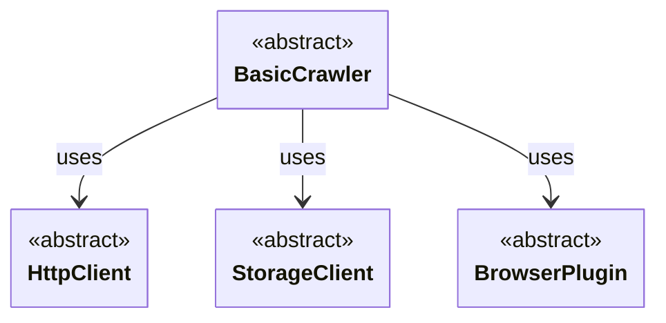

import ApiLink from '@site/src/components/ApiLink';

Crawlee is built around a small number of abstract base classes that you can subclass to plug in your own behavior. This guide is the map: it lists every extension point, states the contract each one defines, and links to the guide that covers it in depth.

If you maintain a third-party integration, such as an alternative browser backend or a storage adapter, you can build it against these contracts and host the integration guide in your own project. This page gives your users a stable reference for the interface your integration implements.

## Extension points

Crawlee currently has four extension points.

### Crawlers

Subclass a crawler when you need a parsing strategy or a request-handler context that the built-in crawlers do not provide.

For HTTP-based crawling, <ApiLink to="class/AbstractHttpCrawler">`AbstractHttpCrawler`</ApiLink> is the base class. A custom crawler supplies a parser that turns an HTTP response into your parsed type, a context type that exposes that parsed data to request handlers, and the crawler class that ties the two together. Everything else, including retries, concurrency, session management, and storage, is inherited from <ApiLink to="class/BasicCrawler">`BasicCrawler`</ApiLink>.

See [HTTP crawlers guide](./http-crawlers) for a worked example built on `selectolax`, and [Architecture overview](./architecture-overview) for how crawlers relate to the other components.

### HTTP clients

Subclass an HTTP client when you want crawlers to talk to servers through a different HTTP library, or through a proxy or transport layer that the bundled clients do not cover.

<ApiLink to="class/HttpClient">`HttpClient`</ApiLink> is the base class. Implementations must be async-compatible and must manage their own connection lifecycle and cleanup, because a single client instance is shared across concurrent requests.

See [HTTP clients guide](./http-clients) for the full interface and the built-in implementations.

### Storage clients

Subclass a storage client when you want Crawlee's storages to be backed by a system that is not covered by the built-in memory, file system, SQL, and Redis clients.

<ApiLink to="class/StorageClient">`StorageClient`</ApiLink> is the base class. It is a factory: it opens the per-storage clients for datasets, key-value stores, and request queues, and those clients implement the actual create, read, update, and delete operations.

See [Storage clients guide](./storage-clients) for the interface, a custom client example, and how clients are registered and resolved.

### Browser plugins

Subclass a browser plugin when an integration launches browsers through an API other than the standard Playwright one. Configuration options on <ApiLink to="class/PlaywrightBrowserPlugin">`PlaywrightBrowserPlugin`</ApiLink> cover the cases where the standard launch API is enough, so reach for a subclass only when the launch path itself differs.

A plugin's `new_browser()` launches the browser and returns a <ApiLink to="class/PlaywrightBrowserController">`PlaywrightBrowserController`</ApiLink>; <ApiLink to="class/BrowserPool">`BrowserPool`</ApiLink> initializes the plugin, forwards browser context options when creating pages, and manages the controller's lifecycle.

See [Playwright crawler guide](./playwright-crawler) for the contract and the responsibilities a subclass has to preserve, and the [Camoufox example](../examples/playwright-crawler-with-camoufox) for a complete integration.

## Choosing an extension point

Match the layer to what actually differs in your integration.

- The response is fetched the usual way but parsed differently: extend a **crawler**.
- The response is fetched over a different HTTP library or transport: extend an **HTTP client**.
- Requests and results should live somewhere other than the built-in backends: extend a **storage client**.
- Browsers are launched through a different API: extend a **browser plugin**.

Prefer configuration over a subclass wherever the built-in class already exposes the knob you need. Subclassing ties your integration to a contract that only changes with Crawlee's major versions, while configuration keeps you on the maintained path.

## Conclusion

Crawlee's extension points are crawlers, HTTP clients, storage clients, and browser plugins. Each is an abstract base class with a documented contract and a guide that covers it in depth. If you are building an integration, start from the contract that matches the layer you are replacing, and keep the rest of the pipeline on the built-in path.
