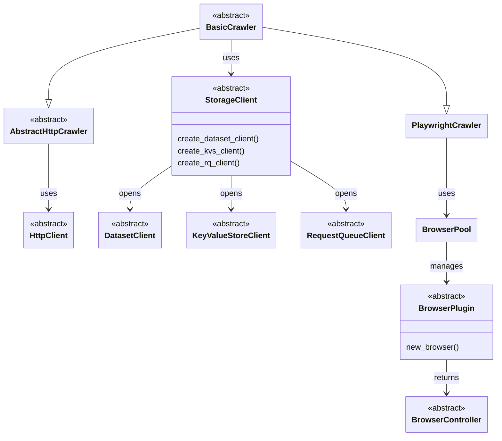

import ApiLink from '@site/src/components/ApiLink';

Crawlee covers the common cases out of the box, but sooner or later you'll hit something it doesn't do: a parser for a format no built-in crawler understands, an HTTP backend your company mandates, a database you want your data in, or a browser that isn't launched the standard Playwright way. Rather than forking, you can plug your own implementation into the layer that differs and keep everything else.

This guide is the map. It covers the extension points, the contract each one defines, and links to the guide that goes deeper on it. If you maintain a third-party integration, you can build it against these contracts and host your own guide for it.

## Extension points

The four extension points below are the main ones, and they're where most integrations plug in. They aren't the only abstract classes you can subclass - <ApiLink to="class/RequestLoader">`RequestLoader`</ApiLink>, <ApiLink to="class/FingerprintGenerator">`FingerprintGenerator`</ApiLink>, and <ApiLink to="class/RenderingTypePredictor">`RenderingTypePredictor`</ApiLink> are extensible too.

### Crawlers

A crawler drives the whole run: it takes requests from the queue, fetches each one, builds the context object your handler receives, and manages retries, concurrency, sessions, and storage along the way. <ApiLink to="class/BasicCrawler">`BasicCrawler`</ApiLink> implements all of that and stays agnostic about how a page is fetched or parsed, which is what makes it the base every other crawler builds on.

For HTTP-based crawling, <ApiLink to="class/AbstractHttpCrawler">`AbstractHttpCrawler`</ApiLink> adds the fetch-and-parse layer on top. Extending it means supplying a parser that implements <ApiLink to="class/AbstractHttpParser">`AbstractHttpParser`</ApiLink>: `parse` turns an <ApiLink to="class/HttpResponse">`HttpResponse`</ApiLink> into your parsed type, `parse_text` does the same for a string, `select` and `is_matching_selector` apply selectors to it, and `find_links` extracts the URLs used for link enqueuing. You then pair that parser with a context type that exposes the parsed data to handlers, and a crawler class that ties the two together.

See the [HTTP crawlers guide](./http-crawlers) for a worked example built on `selectolax`, and the [Architecture overview](./architecture-overview) for how crawlers relate to the other components.

### HTTP clients

An HTTP client is what actually performs the network calls for HTTP-based crawlers. Swapping it changes the transport - the TLS stack, connection pooling, proxy handling, and browser impersonation - without touching how pages are parsed or how the crawl is orchestrated.

The contract is <ApiLink to="class/HttpClient">`HttpClient`</ApiLink>. `crawl` performs a request inside the crawler's pipeline and returns the result the crawler consumes, `send_request` covers standalone calls made from a handler, `stream` yields a response you read incrementally, and `cleanup` releases whatever the client holds open. Crawlee ships <ApiLink to="class/ImpitHttpClient">`ImpitHttpClient`</ApiLink>, <ApiLink to="class/HttpxHttpClient">`HttpxHttpClient`</ApiLink>, and <ApiLink to="class/CurlImpersonateHttpClient">`CurlImpersonateHttpClient`</ApiLink>.

See the [HTTP clients guide](./http-clients) for the full contract and the trade-offs between the built-in clients.

### Storage clients

A storage client is the backend behind Crawlee's three storages. <ApiLink to="class/Dataset">`Dataset`</ApiLink>, <ApiLink to="class/KeyValueStore">`KeyValueStore`</ApiLink>, and <ApiLink to="class/RequestQueue">`RequestQueue`</ApiLink> are the API you write against, and the storage client decides where that data actually lives. That separation is what lets you move a crawler from the local file system to a database or a cloud service without changing crawl code.

<ApiLink to="class/StorageClient">`StorageClient`</ApiLink> itself is only three factory methods - `create_dataset_client`, `create_kvs_client`, and `create_rq_client`. The real work sits in what they return: <ApiLink to="class/DatasetClient">`DatasetClient`</ApiLink> handles appending and reading items, <ApiLink to="class/KeyValueStoreClient">`KeyValueStoreClient`</ApiLink> handles record get, set, delete, and iteration, and <ApiLink to="class/RequestQueueClient">`RequestQueueClient`</ApiLink> handles adding, fetching, and marking requests as handled. A custom backend implements all four.

See the [Storage clients guide](./storage-clients) for the built-in implementations and a custom client example.

### Browser plugins

A browser plugin is what launches browsers for <ApiLink to="class/PlaywrightCrawler">`PlaywrightCrawler`</ApiLink>. The crawler never launches one itself: it goes through <ApiLink to="class/BrowserPool">`BrowserPool`</ApiLink>, which initializes the plugins it's given, forwards browser context options when creating pages, and manages each browser's lifecycle.

The contract is <ApiLink to="class/BrowserPlugin">`BrowserPlugin`</ApiLink>. Its `new_browser` launches a browser and returns a <ApiLink to="class/BrowserController">`BrowserController`</ApiLink>, which is what the pool then drives to open pages and tear things down. Reach for a subclass when the launch path itself differs from the standard Playwright one, since <ApiLink to="class/PlaywrightBrowserPlugin">`PlaywrightBrowserPlugin`</ApiLink>'s configuration options already cover the cases where it doesn't.

See the [Playwright crawler guide](./playwright-crawler) for the responsibilities a subclass has to preserve, and the [Camoufox example](../examples/playwright-crawler-with-camoufox) for a complete integration.

## Choosing an extension point

Match the layer to what actually differs in your integration.

- The response format is one no built-in crawler parses - subclass <ApiLink to="class/AbstractHttpCrawler">`AbstractHttpCrawler`</ApiLink> with your own parser.
- The transport differs, but parsing doesn't - implement <ApiLink to="class/HttpClient">`HttpClient`</ApiLink> and pass it to any HTTP crawler.
- Data needs to live somewhere Crawlee doesn't support yet - implement <ApiLink to="class/StorageClient">`StorageClient`</ApiLink> and its three per-storage clients.
- Browsers need to be launched through a different API - implement <ApiLink to="class/BrowserPlugin">`BrowserPlugin`</ApiLink> and hand it to <ApiLink to="class/BrowserPool">`BrowserPool`</ApiLink>.

When more than one fits, pick the narrowest. A custom HTTP client works with every HTTP crawler, so it's easier to maintain than a crawler subclass that hard-codes the same transport.

## Conclusion

Each extension point is a small abstract class with a documented contract, and everything above it keeps working once you implement one. If you're building a third-party integration, these contracts are also the stable surface to write your own documentation against.

If anything here is unclear or you hit a case the contracts don't cover, open an issue on [GitHub](https://github.com/apify/crawlee-python) or join our [Discord](https://discord.com/invite/jyEM2PRvMU).
