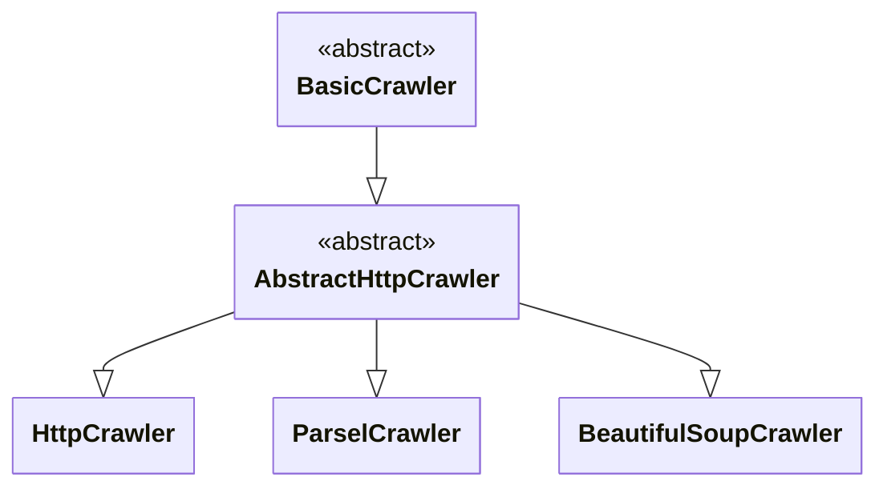

import ApiLink from '@site/src/components/ApiLink';
import Tabs from '@theme/Tabs';
import TabItem from '@theme/TabItem';
import RunnableCodeBlock from '@site/src/components/RunnableCodeBlock';
import CodeBlock from '@theme/CodeBlock';

import BeautifulSoupExample from '!!raw-loader!roa-loader!./code_examples/http_crawlers/beautifulsoup_example.py';
import ParselExample from '!!raw-loader!roa-loader!./code_examples/http_crawlers/parsel_example.py';
import HttpExample from '!!raw-loader!roa-loader!./code_examples/http_crawlers/http_example.py';

import LxmlParser from '!!raw-loader!roa-loader!./code_examples/http_crawlers/lxml_parser.py';
import LxmlSaxoncheParser from '!!raw-loader!roa-loader!./code_examples/http_crawlers/lxml_saxonche_parser.py';
import LexborParser from '!!raw-loader!roa-loader!./code_examples/http_crawlers/lexbor_parser.py';
import PyqueryParser from '!!raw-loader!roa-loader!./code_examples/http_crawlers/pyquery_parser.py';
import ScraplingParser from '!!raw-loader!roa-loader!./code_examples/http_crawlers/scrapling_parser.py';

import SelectolaxParserSource from '!!raw-loader!./code_examples/http_crawlers/selectolax_parser.py';
import SelectolaxContextSource from '!!raw-loader!./code_examples/http_crawlers/selectolax_context.py';
import SelectolaxCrawlerSource from '!!raw-loader!./code_examples/http_crawlers/selectolax_crawler.py';
import SelectolaxCrawlerRunSource from '!!raw-loader!./code_examples/http_crawlers/selectolax_crawler_run.py';
import AdaptiveCrawlerRunSource from '!!raw-loader!./code_examples/http_crawlers/selectolax_adaptive_run.py';

HTTP crawlers are ideal for extracting data from server-rendered websites that don't require JavaScript execution. These crawlers make requests via HTTP clients to fetch HTML content and then parse it using various parsing libraries. For client-side rendered content, where you need to execute JavaScript consider using [Playwright crawler](https://crawlee.dev/python/docs/guides/playwright-crawler) instead.

## Overview

All HTTP crawlers share a common architecture built around the <ApiLink to="class/AbstractHttpCrawler">`AbstractHttpCrawler`</ApiLink> base class. The main differences lie in the parsing strategy and the context provided to request handlers. There are <ApiLink to="class/BeautifulSoupCrawler">`BeautifulSoupCrawler`</ApiLink>, <ApiLink to="class/ParselCrawler">`ParselCrawler`</ApiLink>, and <ApiLink to="class/HttpCrawler">`HttpCrawler`</ApiLink>. It can also be extended to create custom crawlers with specialized parsing requirements. They use HTTP clients to fetch page content and parsing libraries to extract data from the HTML, check out the [HTTP clients guide](./http-clients) to learn about the HTTP clients used by these crawlers, how to switch between them, and how to create custom HTTP clients tailored to your specific requirements.

## BeautifulSoupCrawler

The <ApiLink to="class/BeautifulSoupCrawler">`BeautifulSoupCrawler`</ApiLink> uses the [BeautifulSoup](https://www.crummy.com/software/BeautifulSoup/) library for HTML parsing. It provides fault-tolerant parsing that handles malformed HTML, automatic character encoding detection, and supports CSS selectors, tag navigation, and custom search functions. Use this crawler when working with imperfect HTML structures, when you prefer BeautifulSoup's intuitive API, or when prototyping web scraping solutions.

<RunnableCodeBlock className="language-python" language="python">
    {BeautifulSoupExample}
</RunnableCodeBlock>

## ParselCrawler

The <ApiLink to="class/ParselCrawler">`ParselCrawler`</ApiLink> uses the [Parsel](https://parsel.readthedocs.io/) library, which provides XPath 1.0 and CSS selector support built on `lxml` for high performance. It includes built-in regex support for pattern matching, proper XML namespace handling, and offers better performance than BeautifulSoup while maintaining a clean API. Use this crawler when you need XPath functionality, require high-performance parsing, or need to extract data using regular expressions.

<RunnableCodeBlock className="language-python" language="python">
    {ParselExample}
</RunnableCodeBlock>

## HttpCrawler

The <ApiLink to="class/HttpCrawler">`HttpCrawler`</ApiLink> provides direct access to HTTP response body and headers without automatic parsing, offering maximum performance with no parsing overhead. It supports any content type (JSON, XML, binary) and allows complete control over response processing, including memory-efficient handling of large responses. Use this crawler when working with non-HTML content, requiring maximum performance, implementing custom parsing logic, or needing access to raw response data.

<RunnableCodeBlock className="language-python" language="python">
    {HttpExample}
</RunnableCodeBlock>

### Using custom parsers

Since <ApiLink to="class/HttpCrawler">`HttpCrawler`</ApiLink> provides raw HTTP responses, you can integrate any parsing library. Note that helpers like <ApiLink to="class/EnqueueLinksFunction">`enqueue_links`</ApiLink> and <ApiLink to="class/ExtractLinksFunction">`extract_links`</ApiLink> are not available with this approach.

The following examples demonstrate how to integrate with several popular parsing libraries, including [lxml](https://lxml.de/) (high-performance parsing with XPath 1.0), [lxml with SaxonC-HE](https://pypi.org/project/saxonche/) (XPath 3.1 support), [selectolax](https://github.com/rushter/selectolax) (high-speed CSS selectors), [PyQuery](https://pyquery.readthedocs.io/) (jQuery-like syntax), and [scrapling](https://github.com/D4Vinci/Scrapling) (a Scrapy/Parsel-style API offering BeautifulSoup-like methods).

<Tabs groupId="custom_parsers">
    <TabItem value="lxml" label="lxml">
        <RunnableCodeBlock className="language-python" language="python">
            {LxmlParser}
        </RunnableCodeBlock>
    </TabItem>
    <TabItem value="saxonche" label="lxml with SaxonC-HE">
        <RunnableCodeBlock className="language-python" language="python">
            {LxmlSaxoncheParser}
        </RunnableCodeBlock>
    </TabItem>
    <TabItem value="selectolax" label="selectolax">
        <RunnableCodeBlock className="language-python" language="python">
            {LexborParser}
        </RunnableCodeBlock>
    </TabItem>
    <TabItem value="pyquery" label="PyQuery">
        <RunnableCodeBlock className="language-python" language="python">
            {PyqueryParser}
        </RunnableCodeBlock>
    </TabItem>
    <TabItem value="scrapling" label="Scrapling">
        <RunnableCodeBlock className="language-python" language="python">
            {ScraplingParser}
        </RunnableCodeBlock>
    </TabItem>
</Tabs>

## Custom HTTP crawler

While the built-in crawlers cover most use cases, you might need a custom HTTP crawler for specialized parsing requirements. To create a custom HTTP crawler, inherit directly from <ApiLink to="class/AbstractHttpCrawler">`AbstractHttpCrawler`</ApiLink>. This approach requires implementing:

1. **Custom parser class**: Inherit from <ApiLink to="class/AbstractHttpParser">`AbstractHttpParser`</ApiLink>.
2. **Custom context class**: Define what data and helpers are available to handlers.
3. **Custom crawler class**: Tie everything together.

This approach is recommended when you need tight integration between parsing and the crawling context, or when you're building a reusable crawler for a specific technology or format.

The following example demonstrates how to create a custom crawler using `selectolax` with the `Lexbor` engine.

### Parser implementation

The parser converts HTTP responses into a parsed document and provides methods for element selection. Implement <ApiLink to="class/AbstractHttpParser">`AbstractHttpParser`</ApiLink> using `selectolax` with required methods for parsing and querying:

<CodeBlock className="language-python" language="python" title="selectolax_parser.py">
    {SelectolaxParserSource}
</CodeBlock>

This is enough to use your parser with `AbstractHttpCrawler.create_parsed_http_crawler_class` factory method. For more control, continue with custom context and crawler classes below.

### Crawling context definition (optional)

The crawling context is passed to request handlers and provides access to the parsed content. Extend <ApiLink to="class/ParsedHttpCrawlingContext">`ParsedHttpCrawlingContext`</ApiLink> to define the interface your handlers will work with. Here you can implement additional helpers for the crawler context.

<CodeBlock className="language-python" language="python" title="selectolax_context.py">
    {SelectolaxContextSource}
</CodeBlock>

### Crawler composition

The crawler class connects the parser and context. Extend <ApiLink to="class/AbstractHttpCrawler">`AbstractHttpCrawler`</ApiLink> and configure the context pipeline to use your custom components:

<CodeBlock className="language-python" language="python" title="selectolax_crawler.py">
    {SelectolaxCrawlerSource}
</CodeBlock>

### Crawler usage

The custom crawler works like any built-in crawler. Request handlers receive your custom context with full access to framework helpers like <ApiLink to="class/EnqueueLinksFunction">`enqueue_links`</ApiLink>. Additionally, the custom parser can be used with <ApiLink to="class/AdaptivePlaywrightCrawler">`AdaptivePlaywrightCrawler`</ApiLink> for adaptive crawling:

<Tabs groupId="crawlers">
    <TabItem value="selectolax_crawler" label="SelectolaxCrawler">
        <CodeBlock className="language-python" language="python">
            {SelectolaxCrawlerRunSource}
        </CodeBlock>
    </TabItem>
    <TabItem value="adaptive_playwright_crawler" label="AdaptivePlaywrightCrawler with SelectolaxParser">
        <CodeBlock className="language-python" language="python">
            {AdaptiveCrawlerRunSource}
        </CodeBlock>
    </TabItem>
</Tabs>

## Conclusion

This guide provided a comprehensive overview of HTTP crawlers in Crawlee. You learned about the three main crawler types - <ApiLink to="class/BeautifulSoupCrawler">`BeautifulSoupCrawler`</ApiLink> for fault-tolerant HTML parsing, <ApiLink to="class/ParselCrawler">`ParselCrawler`</ApiLink> for high-performance extraction with XPath and CSS selectors, and <ApiLink to="class/HttpCrawler">`HttpCrawler`</ApiLink> for raw response processing. You also discovered how to integrate third-party parsing libraries with <ApiLink to="class/HttpCrawler">`HttpCrawler`</ApiLink> and how to create fully custom crawlers using <ApiLink to="class/AbstractHttpCrawler">`AbstractHttpCrawler`</ApiLink> for specialized parsing requirements.

If you have questions or need assistance, feel free to reach out on our [GitHub](https://github.com/apify/crawlee-python) or join our [Discord community](https://discord.com/invite/jyEM2PRvMU). Happy scraping!
