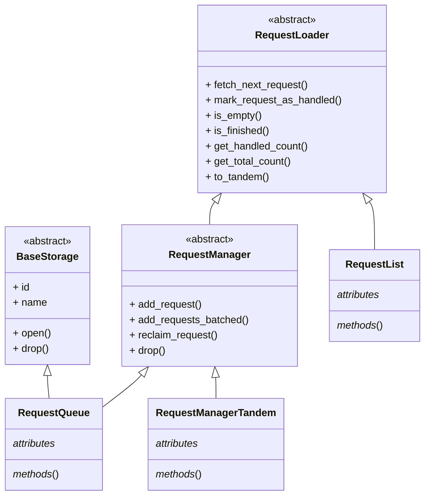

import ApiLink from '@site/src/components/ApiLink';
import Tabs from '@theme/Tabs';
import TabItem from '@theme/TabItem';
import CodeBlock from '@theme/CodeBlock';

import RlBasicExample from '!!raw-loader!./code_examples/request_loaders/rl_basic_example.py';

import TandemExample from '!!raw-loader!./code_examples/request_loaders/tandem_example.py';
import ExplicitTandemExample from '!!raw-loader!./code_examples/request_loaders/tandem_example_explicit.py';

The [`request_loaders`](https://github.com/apify/crawlee-python/tree/master/src/crawlee/request_loaders) sub-package extends the functionality of the <ApiLink to="class/RequestQueue">`RequestQueue`</ApiLink>, providing additional tools for managing URLs. If you are new to Crawlee, and you do not know the `RequestQueue`, consider starting with the [Storages](https://crawlee.dev/python/docs/guides/storages) guide first. Request loaders define how requests are fetched and stored, enabling various use cases, such as reading URLs from files, external APIs or combining multiple sources together.

## Overview

The [`request_loaders`](https://github.com/apify/crawlee-python/tree/master/src/crawlee/request_loaders) sub-package introduces the following abstract classes:

- <ApiLink to="class/RequestLoader">`RequestLoader`</ApiLink>: The base interface for reading requests in a crawl.
- <ApiLink to="class/RequestManager">`RequestManager`</ApiLink>: Extends `RequestLoader` with write capabilities.
- <ApiLink to="class/RequestManagerTandem">`RequestManagerTandem`</ApiLink>: Combines a read-only `RequestLoader` with a writable `RequestManager`.

And one specific request loader:

- <ApiLink to="class/RequestList">`RequestList`</ApiLink>: A lightweight implementation of request loader for managing a static list of URLs.

Below is a class diagram that illustrates the relationships between these components and the <ApiLink to="class/RequestQueue">`RequestQueue`</ApiLink>:

## Request loader

The <ApiLink to="class/RequestLoader">`RequestLoader`</ApiLink> interface defines the foundation for fetching requests during a crawl. It provides abstract methods for basic operations like retrieving, marking, or checking the status of requests. Concrete implementations, such as <ApiLink to="class/RequestList">`RequestList`</ApiLink>, build on this interface to handle specific scenarios. You may create your own loader that reads from an external file, a web endpoint, a database or matches some other specific scenario. For more details refer to the <ApiLink to="class/RequestLoader">`RequestLoader`</ApiLink> API reference.

The <ApiLink to="class/RequestList">`RequestList`</ApiLink> can accept an asynchronous generator as input. This allows the requests to be streamed, rather than loading them all into memory at once. This can significantly reduce the memory usage, especially when working with large sets of URLs.

Here is a basic example of working with the <ApiLink to="class/RequestList">`RequestList`</ApiLink>:

<CodeBlock className="language-python">
    {RlBasicExample}
</CodeBlock>

## Request manager

The <ApiLink to="class/RequestManager">`RequestManager`</ApiLink> extends `RequestLoader` with write capabilities. In addition to reading requests, a request manager can add or reclaim them. This is important for dynamic crawling projects, where new URLs may emerge during the crawl process. Or when certain requests may failed and need to be retried. For more details refer to the <ApiLink to="class/RequestManager">`RequestManager`</ApiLink> API reference.

## Request manager tandem

The <ApiLink to="class/RequestManagerTandem">`RequestManagerTandem`</ApiLink> class allows you to combine the read-only capabilities `RequestLoader` (like <ApiLink to="class/RequestList">`RequestList`</ApiLink>) with read-write capabilities of a `RequestManager` (like <ApiLink to="class/RequestQueue">`RequestQueue`</ApiLink>). This is useful for scenarios where you need to load initial requests from a static source (like a file or database) and dynamically add or retry requests during the crawl. Additionally, it provides deduplication capabilities, ensuring that requests are not processed multiple times. Under the hood, <ApiLink to="class/RequestManagerTandem">`RequestManagerTandem`</ApiLink> checks whether the read-only loader still has pending requests. If so, each new request from the loader is transferred to the manager. Any newly added or reclaimed requests go directly to the manager side.

### Request list with request queue

This sections describes the combination of the <ApiLink to="class/RequestList">`RequestList`</ApiLink> and <ApiLink to="class/RequestQueue">`RequestQueue`</ApiLink> classes. This setup is particularly useful when you have a static list of URLs that you want to crawl, but you also need to handle dynamic requests during the crawl process. The <ApiLink to="class/RequestManagerTandem">`RequestManagerTandem`</ApiLink> class facilitates this combination, with the <ApiLink to="class/RequestLoader#to_tandem">`RequestLoader.to_tandem`</ApiLink> method available as a convenient shortcut. Requests from the <ApiLink to="class/RequestList">`RequestList`</ApiLink> are processed first by enqueuing them into the default <ApiLink to="class/RequestQueue">`RequestQueue`</ApiLink>, which handles persistence and retries failed requests.

<Tabs groupId="request_manager_tandem">
    <TabItem value="request_manager_tandem_explicit" label="Explicitly usage">
        <CodeBlock className="language-python">
            {ExplicitTandemExample}
        </CodeBlock>
    </TabItem>
    <TabItem value="request_manager_tandem_helper" label="Using to_tandem helper" default>
        <CodeBlock className="language-python">
            {TandemExample}
        </CodeBlock>
    </TabItem>
</Tabs>

## Conclusion

This guide explained the `request_loaders` sub-package, which extends the functionality of the `RequestQueue` with additional tools for managing URLs. You learned about the `RequestLoader`, `RequestManager`, and `RequestManagerTandem` classes, as well as the `RequestList` class. You also saw examples of how to work with these classes in practice. If you have questions or need assistance, feel free to reach out on our [GitHub](https://github.com/apify/crawlee-python) or join our [Discord community](https://discord.com/invite/jyEM2PRvMU). Happy scraping!
