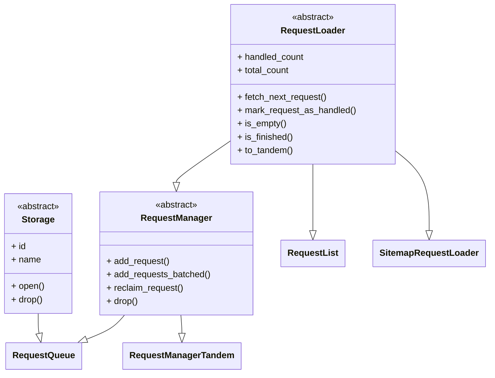

import ApiLink from '@site/src/components/ApiLink';
import Tabs from '@theme/Tabs';
import TabItem from '@theme/TabItem';
import RunnableCodeBlock from '@site/src/components/RunnableCodeBlock';

import RlBasicExample from '!!raw-loader!roa-loader!./code_examples/request_loaders/rl_basic_example.py';
import SitemapExample from '!!raw-loader!roa-loader!./code_examples/request_loaders/sitemap_basic_example.py';
import RlTandemExample from '!!raw-loader!roa-loader!./code_examples/request_loaders/rl_tandem_example.py';
import RlExplicitTandemExample from '!!raw-loader!roa-loader!./code_examples/request_loaders/rl_tandem_example_explicit.py';
import SitemapTandemExample from '!!raw-loader!roa-loader!./code_examples/request_loaders/sitemap_tandem_example.py';
import SitemapExplicitTandemExample from '!!raw-loader!roa-loader!./code_examples/request_loaders/sitemap_tandem_example_explicit.py';
import RlBasicPersistExample from '!!raw-loader!roa-loader!./code_examples/request_loaders/rl_basic_example_with_persist.py';
import SitemapPersistExample from '!!raw-loader!roa-loader!./code_examples/request_loaders/sitemap_example_with_persist.py';

The [`request_loaders`](https://github.com/apify/crawlee-python/tree/master/src/crawlee/request_loaders) sub-package extends the functionality of the <ApiLink to="class/RequestQueue">`RequestQueue`</ApiLink>, providing additional tools for managing URLs and requests. If you are new to Crawlee and unfamiliar with the <ApiLink to="class/RequestQueue">`RequestQueue`</ApiLink>, consider starting with the [Storages](https://crawlee.dev/python/docs/guides/storages) guide first. Request loaders define how requests are fetched and stored, enabling various use cases such as reading URLs from files, external APIs, or combining multiple sources together.

## Overview

The [`request_loaders`](https://github.com/apify/crawlee-python/tree/master/src/crawlee/request_loaders) sub-package introduces the following abstract classes:

- <ApiLink to="class/RequestLoader">`RequestLoader`</ApiLink>: The base interface for reading requests in a crawl.
- <ApiLink to="class/RequestManager">`RequestManager`</ApiLink>: Extends `RequestLoader` with write capabilities.
- <ApiLink to="class/RequestManagerTandem">`RequestManagerTandem`</ApiLink>: Combines a read-only `RequestLoader` with a writable `RequestManager`.

And specific request loader implementations:

- <ApiLink to="class/RequestList">`RequestList`</ApiLink>: A lightweight implementation for managing a static list of URLs.
- <ApiLink to="class/SitemapRequestLoader">`SitemapRequestLoader`</ApiLink>: A specialized loader that reads URLs from XML sitemaps with filtering capabilities.

Below is a class diagram that illustrates the relationships between these components and the <ApiLink to="class/RequestQueue">`RequestQueue`</ApiLink>:

## Request loaders

The <ApiLink to="class/RequestLoader">`RequestLoader`</ApiLink> interface defines the foundation for fetching requests during a crawl. It provides abstract methods for basic operations like retrieving, marking, and checking the status of requests. Concrete implementations, such as <ApiLink to="class/RequestList">`RequestList`</ApiLink>, build on this interface to handle specific scenarios. You can create your own custom loader that reads from an external file, web endpoint, database, or any other specific data source. For more details, refer to the <ApiLink to="class/RequestLoader">`RequestLoader`</ApiLink> API reference.

:::info NOTE
To learn how to use request loaders in your crawlers, see the [Request manager tandem](#request-manager-tandem) section below.
:::

### Request list

The <ApiLink to="class/RequestList">`RequestList`</ApiLink> can accept an asynchronous generator as input, allowing requests to be streamed rather than loading them all into memory at once. This can significantly reduce memory usage, especially when working with large sets of URLs.

Here is a basic example of working with the <ApiLink to="class/RequestList">`RequestList`</ApiLink>:

<RunnableCodeBlock className="language-python" language="python">
    {RlBasicExample}
</RunnableCodeBlock>

### Request list with persistence

The <ApiLink to="class/RequestList">`RequestList`</ApiLink> supports state persistence, allowing it to resume from where it left off after interruption. This is particularly useful for long-running crawls or when you need to pause and resume crawling later.

To enable persistence, provide `persist_state_key` and optionally `persist_requests_key` parameters, and disable automatic cleanup by setting `purge_on_start = False` in the configuration. The `persist_state_key` saves the loader's progress, while `persist_requests_key` ensures that the request data doesn't change between runs. For more details on resuming interrupted crawls, see the [Resuming a paused crawl](../examples/resuming-paused-crawl) example.

<RunnableCodeBlock className="language-python" language="python">
    {RlBasicPersistExample}
</RunnableCodeBlock>

### Sitemap request loader

The <ApiLink to="class/SitemapRequestLoader">`SitemapRequestLoader`</ApiLink> is a specialized request loader that reads URLs from XML sitemaps. It's particularly useful when you want to crawl a website systematically by following its sitemap structure. The loader supports filtering URLs using glob patterns and regular expressions, allowing you to include or exclude specific types of URLs. The <ApiLink to="class/SitemapRequestLoader">`SitemapRequestLoader`</ApiLink> provides streaming processing of sitemaps, ensuring efficient memory usage without loading the entire sitemap into memory.

<RunnableCodeBlock className="language-python" language="python">
    {SitemapExample}
</RunnableCodeBlock>

### Sitemap request loader with persistence

Similarly, the <ApiLink to="class/SitemapRequestLoader">`SitemapRequestLoader`</ApiLink> supports state persistence to resume processing from where it left off. This is especially valuable when processing large sitemaps that may take considerable time to complete.

<RunnableCodeBlock className="language-python" language="python">
    {SitemapPersistExample}
</RunnableCodeBlock>

When using persistence with `SitemapRequestLoader`, make sure to use the context manager (`async with`) to properly save the state when the work is completed.

## Request managers

The <ApiLink to="class/RequestManager">`RequestManager`</ApiLink> extends `RequestLoader` with write capabilities. In addition to reading requests, a request manager can add and reclaim them. This is essential for dynamic crawling projects where new URLs may emerge during the crawl process, or when certain requests fail and need to be retried. For more details, refer to the <ApiLink to="class/RequestManager">`RequestManager`</ApiLink> API reference.

## Request manager tandem

The <ApiLink to="class/RequestManagerTandem">`RequestManagerTandem`</ApiLink> class allows you to combine the read-only capabilities of a `RequestLoader` (like <ApiLink to="class/RequestList">`RequestList`</ApiLink>) with the read-write capabilities of a `RequestManager` (like <ApiLink to="class/RequestQueue">`RequestQueue`</ApiLink>). This is useful for scenarios where you need to load initial requests from a static source (such as a file or database) and dynamically add or retry requests during the crawl. Additionally, it provides deduplication capabilities, ensuring that requests are not processed multiple times.

Under the hood, <ApiLink to="class/RequestManagerTandem">`RequestManagerTandem`</ApiLink> checks whether the read-only loader still has pending requests. If so, each new request from the loader is transferred to the manager. Any newly added or reclaimed requests go directly to the manager side.

### Request list with request queue

This section describes the combination of the <ApiLink to="class/RequestList">`RequestList`</ApiLink> and <ApiLink to="class/RequestQueue">`RequestQueue`</ApiLink> classes. This setup is particularly useful when you have a static list of URLs that you want to crawl, but also need to handle dynamic requests discovered during the crawl process. The <ApiLink to="class/RequestManagerTandem">`RequestManagerTandem`</ApiLink> class facilitates this combination, with the <ApiLink to="class/RequestLoader#to_tandem">`RequestLoader.to_tandem`</ApiLink> method available as a convenient shortcut. Requests from the <ApiLink to="class/RequestList">`RequestList`</ApiLink> are processed first by being enqueued into the default <ApiLink to="class/RequestQueue">`RequestQueue`</ApiLink>, which handles persistence and retries for failed requests.

<Tabs groupId="request_manager_tandem">
    <TabItem value="request_manager_tandem_explicit" label="Explicit usage">
        <RunnableCodeBlock className="language-python" language="python">
            {RlExplicitTandemExample}
        </RunnableCodeBlock>
    </TabItem>
    <TabItem value="request_manager_tandem_helper" label="Using to_tandem helper" default>
        <RunnableCodeBlock className="language-python" language="python">
            {RlTandemExample}
        </RunnableCodeBlock>
    </TabItem>
</Tabs>

### Sitemap request loader with request queue

Similar to the <ApiLink to="class/RequestList">`RequestList`</ApiLink> example above, you can combine a <ApiLink to="class/SitemapRequestLoader">`SitemapRequestLoader`</ApiLink> with a <ApiLink to="class/RequestQueue">`RequestQueue`</ApiLink> using the <ApiLink to="class/RequestManagerTandem">`RequestManagerTandem`</ApiLink> class. This setup is particularly useful when you want to crawl URLs from a sitemap while also handling dynamic requests discovered during the crawl process. URLs from the sitemap are processed first by being enqueued into the default <ApiLink to="class/RequestQueue">`RequestQueue`</ApiLink>, which handles persistence and retries for failed requests.

<Tabs groupId="sitemap_request_manager_tandem">
    <TabItem value="sitemap_request_manager_tandem_explicit" label="Explicit usage">
        <RunnableCodeBlock className="language-python" language="python">
            {SitemapExplicitTandemExample}
        </RunnableCodeBlock>
    </TabItem>
    <TabItem value="sitemap_request_manager_tandem_helper" label="Using to_tandem helper" default>
        <RunnableCodeBlock className="language-python" language="python">
            {SitemapTandemExample}
        </RunnableCodeBlock>
    </TabItem>
</Tabs>

## Conclusion

This guide explained the `request_loaders` sub-package, which extends the functionality of the `RequestQueue` with additional tools for managing URLs and requests. You learned about the `RequestLoader`, `RequestManager`, and `RequestManagerTandem` classes, as well as the `RequestList` and `SitemapRequestLoader` implementations. You also saw practical examples of how to work with these classes to handle various crawling scenarios.

If you have questions or need assistance, feel free to reach out on our [GitHub](https://github.com/apify/crawlee-python) or join our [Discord community](https://discord.com/invite/jyEM2PRvMU). Happy scraping!
